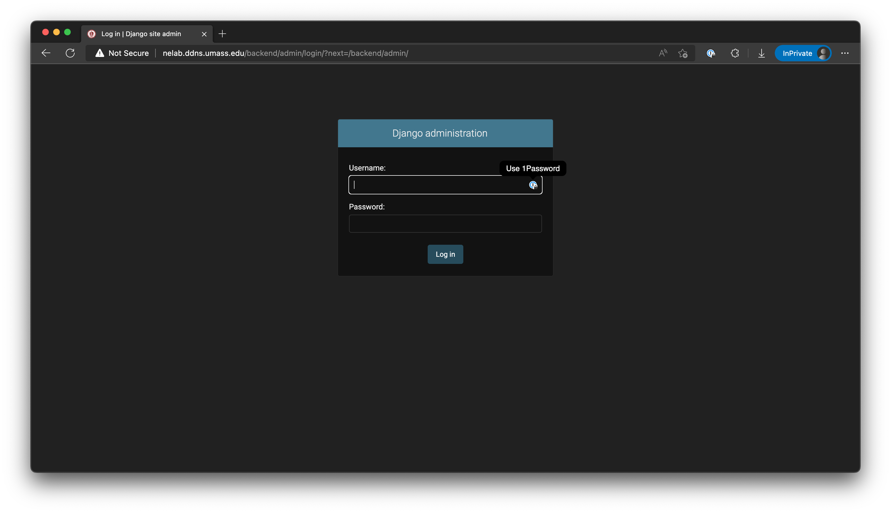
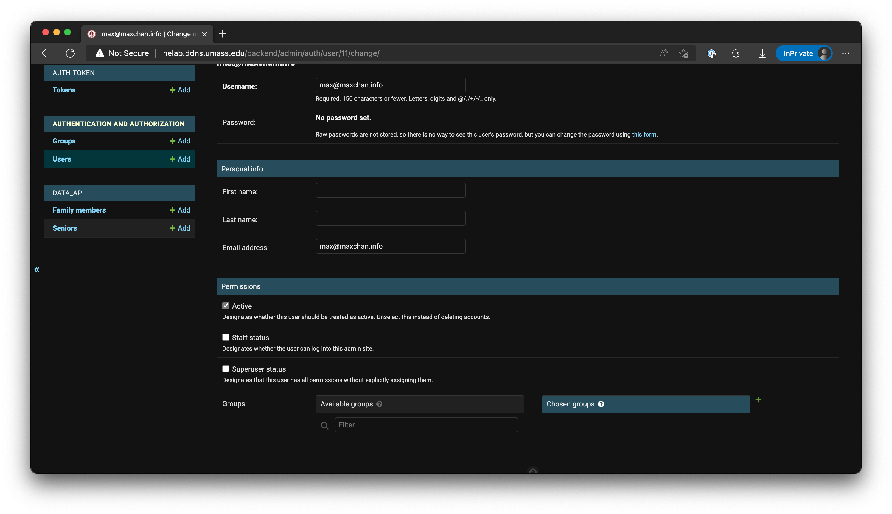

# UMASS HCM Administration Guide

This guide will walk you through administering the UMASS HCM system.

[Click this link](http://nelab.ddns.umass.edu/backend/admin/) to enter the UMASS
HCM system admin UI. You must be connected to UMass Amherst campus network for
this link to work.

## Logging In

While the user interface uses email and tokens for login, the admin interface
requires the use of a user name and a password.

## Admin Dashboard

Once you logged in to the admin interface, you see the admin dashboard.

### Assigning admin rights to a user

To assign admin rights to a user, we change the Users table. Click on the Users
link on the dashboard to enter that table, and clock on the user in question.

Under the Permissions section, there are two options: Staff status and Superuser
status. Admins have both statuses flagged, and patients have neither flagged.

### Assigning devices to a user

