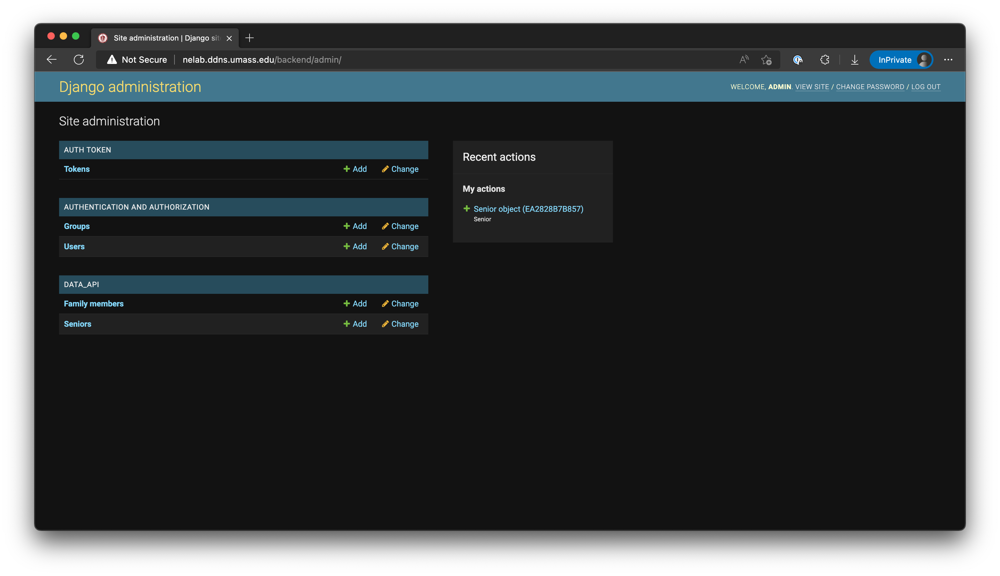

# UMASS HCM Administration Guide

This guide will walk you through administering the UMASS HCM system.

[Click this link](http://nelab.ddns.umass.edu/backend/admin/) to enter the UMASS
HCM system admin UI. You must be connected to UMass Amherst campus network for
this link to work.

## Logging In

While the user interface uses email and tokens for login, the admin interface
requires the use of a user name and a password.

## Admin Dashboard

Once you logged in to the admin interface, you see the admin dashboard.

### Assigning admin rights to a user

To assign admin rights to a user, we change the Users table. Click on the Users
link on the dashboard to enter that table, and click on the user in question.

Under the Permissions section, there are two options: Staff status and Superuser
status. Admins have both statuses flagged, and patients have neither flagged.

### Assigning a device to a user

To assign a device to a user, we change the Seniors table. We enter the table by
clicking on the Seniors link in the dashboard.

**NOTE:** Device assignments can not be changed after creation, only deleted and
recreate afterwards. Be careful when making changes.

All devices are identified by their MAC address. If the device is currently
assigned to someone, the assignment need to be deleted beforehand.

To create an assignment, click on the Add Senior button on the top right. Then
you input the patient's information as well as the corresponding device's MAC
address. The MAC address used here should have no separator - that is, input the
string `112233445566` for MAC address `11:22:33:44:55:66`.

To delete an assignment, clock on the Senior object with the corresponding MAC
address, then click on the red Delete button on the bottom.

## Copyright

Copyright &copy; 2021-2023 University of Massachusetts Amherst.
