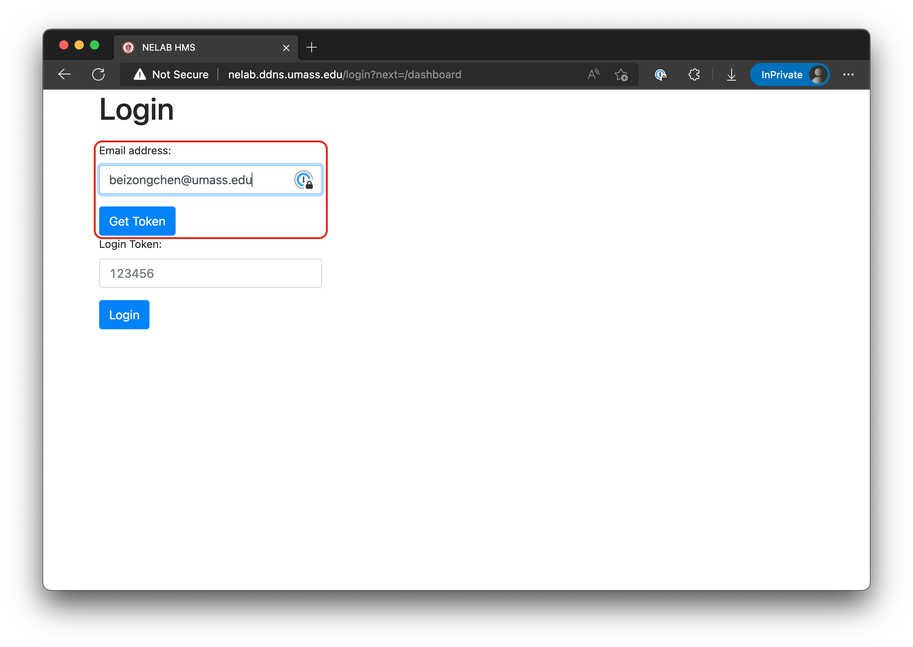
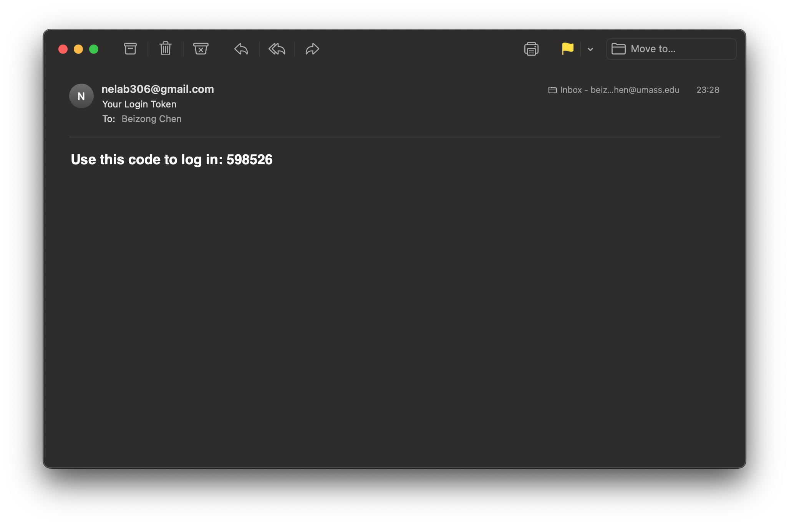
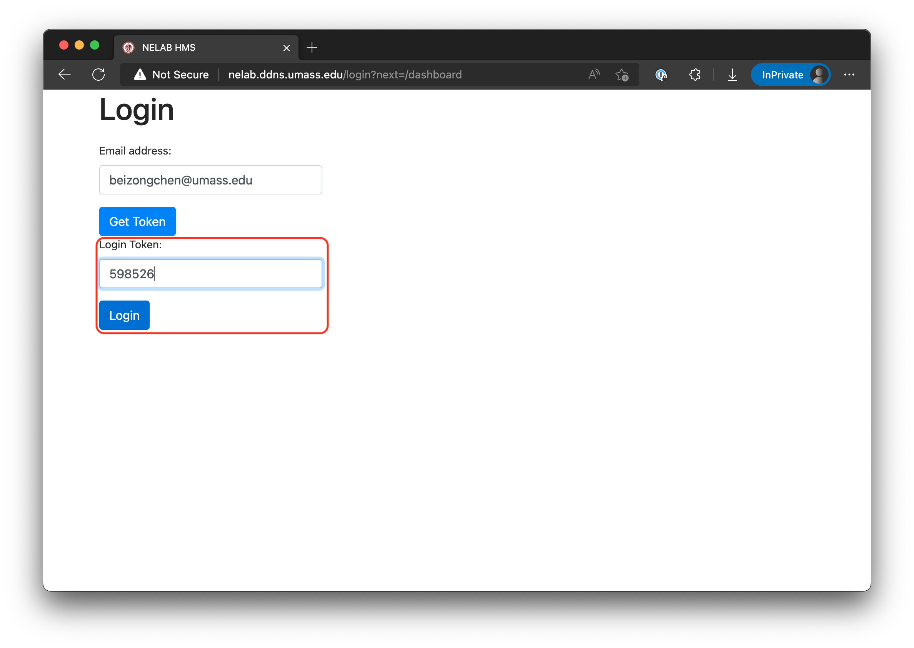
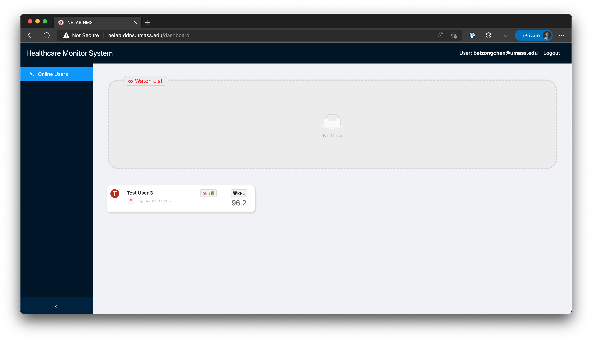
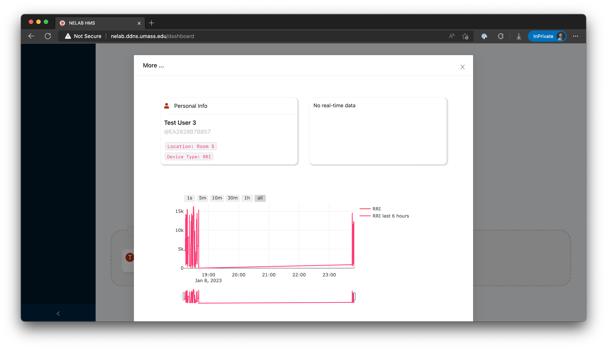

# UMASS HCM User Guide

This guide will walk you through using the UMASS HCM system.

[Click this link](http://nelab.ddns.umass.edu) to enter the UMASS HCM system.
You must be connected to UMass Amherst campus network for this link to work.

## System Requirements

UMASS HCM is a Web based application that runs within your browser. It requires
a sufficiently modern browser to operate. Internet Explorer and non-Chromium
Microsoft Edge are unsupported.

## Logging In

You will need to log in before your can access this dashboard.

### Where is the sign up button?

There is no need to sign up. You will be automatically signed up with a new user
account when you log in for the first time.

### Log in procedure

To sign in, you put your Email address into the Email field, and click the "Get
Token" button.

You will receive an Email from our server that includes the 6-digit token. Each
token are good for 5 minutes or one login attempt.

Put the token in the corresponding field, and click the Login button to enter
the system.

## Using the System

After you have logged in to the system, you will be greeted with the dashboard.

### Using the dashboard

The dashboard displays sensor state in three categories:

* Watch List,
* Normal, and
* Inactive. 

For all devices that is in the Watch List and Normal states, the dashboard will
display the patient's name, and rotate live data of the patient's RRI-calculated
heart rate and body temperature.

Patients listed in the Watch List have at least one sensor that is out of the
normal range. Those patients may need immediate attention.

Patients listed in the Inactive section are offline. They do not have live data
being reported into the system, however you can still view their logged data.

### Viewing the patient's details and logged data

You can click on the card representing any patient to access their detail card
and logged data.

The two graphs are interactive. You can use the change the time scale and view
port of the graph by dragging the range controls and the view window on the
overview plot. You can also use the buttons above to quickly change the time
scale.

## Copyright

Copyright &copy; 2021-2023 University of Massachusetts Amherst
